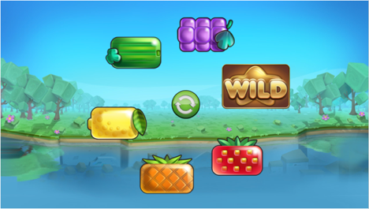

# Specification

Deploy: https://ts-bcamp-2023-pixijs-hw-ps.netlify.app/

## Layout:

Basic layout consists of Background image, button in the center of the background and 6 symbols that are moving around the button (see Figure 1).

*Figure 1 Basic Layout of the App*

## Behaviour:

App can persist in 2 states: Idle and Accelerated.

Initial state is Idle – Button is activated, and symbols are moving around Button with normal speed along a circular path.

States are toggled with Button click.

When a user clicks a Button, App is in Idle state and button is in Active state - App starts a transition to Accelerated state, that lasts for 1 second, indicated by deactivating the button (from green is becomes grey) and increasing speed of symbols.

Accelerated transition ends with activating the button (from grey to green) and symbols now moving 4 times the normal speed.

When user clicks a Button, App is in Accelerated state and Button is in active state – App start a transition to Idle state, that lasts for 1 second, indicated by deactivating the button (from green to grey) and decreasing speed of symbols to normal speed.
Transition ends with activating the button (from grey to green) and symbols moving with normal speed.

## Technical specification:

* Game should be playable on desktop with Chrome, Firefox or Safari browsers at least.

* All assets should be preloaded before the start of the game.

* Try build a project structure keeping in mind maintenance and extension, avoid implementing all code in one file.

*  _Additional task: develop responsive mobile view_ - **optional**

## Recommended technologies:

* Typescript or ES2015+

* Pixi.js

* Webpack or Parcel

## References:

* [PixiJS](https://www.pixijs.com/) rendering engine

* [Typescript](https://www.typescriptlang.org/)

* [Webpack](https://webpack.js.org/) bundler

  

Basic assets included.
## Submitting your solution

Please push your changes to the `main branch` of this repository. You can push one or more commits.  

Once you are finished with the task, please click the `Submit Solution` link on <a href="https://app.codescreen.com/candidate/3ed49abd-3505-4255-9816-ecb28ac07683" target="_blank">this screen</a>.
